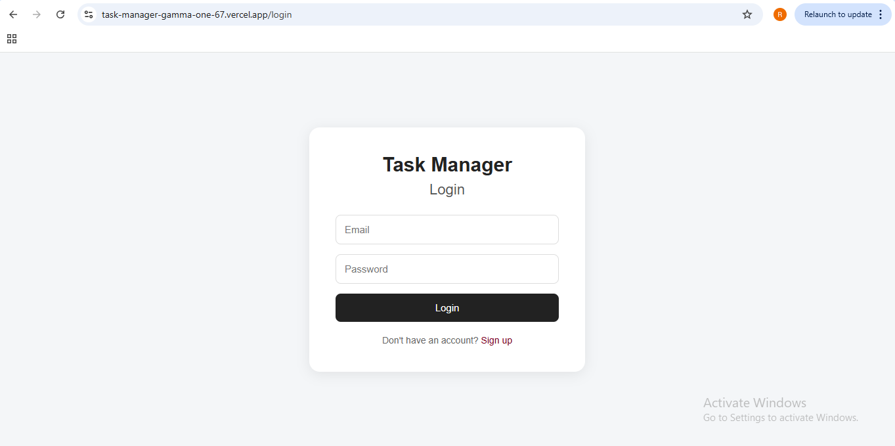
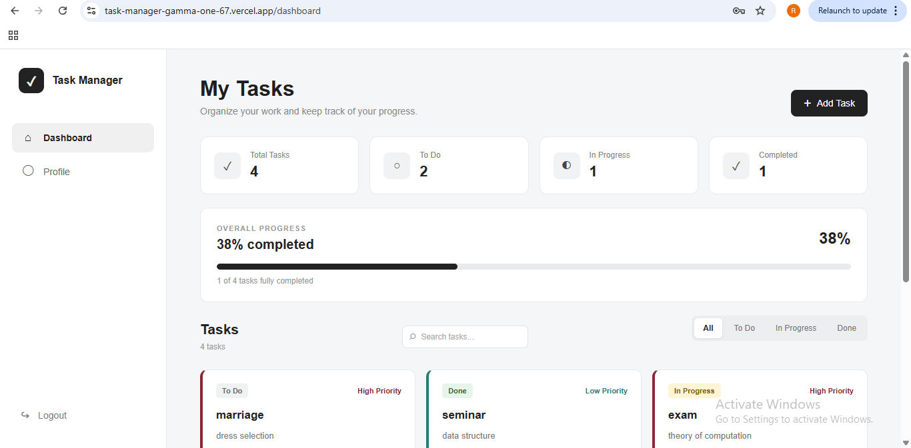
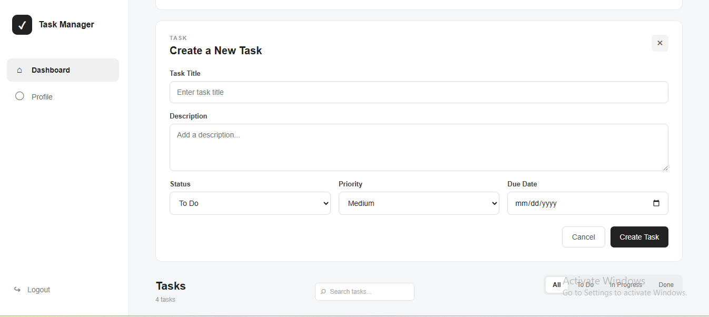
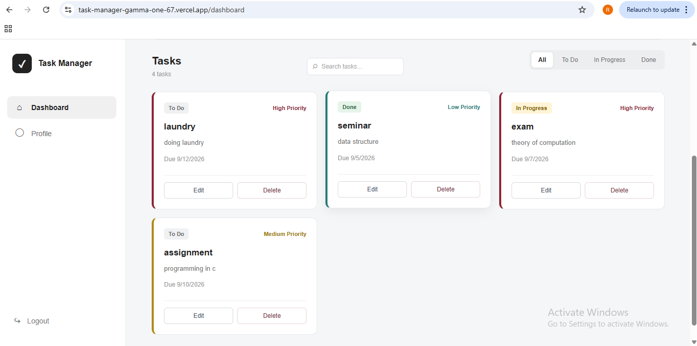

# 📝 Task Manager

A full-stack **MERN Task Manager** application that allows users to securely register, log in, and manage their personal tasks.

The application provides JWT-based authentication, protected routes, task CRUD operations, task status management, priorities, due dates, and user-specific task access.

## 🌐 Live Demo

|                          | Link                                         |
| ------------------------ | -------------------------------------------- |
| 🚀 **Frontend**          | https://task-manager-gamma-one-67.vercel.app |
| ⚙️ **Backend API**       | https://task-manager-qlnk.onrender.com       |
| 💻 **GitHub Repository** | https://github.com/rinshaav/task-manager     |

---

## ✨ Features

### 🔐 Authentication

* User registration and login
* Secure password hashing using bcrypt
* JWT-based authentication
* HTTP-only authentication cookies
* Protected routes
* Logout functionality
* User-specific access control

### 📋 Task Management

* Create new tasks
* View personal tasks
* Update existing tasks
* Delete tasks
* Change task status
* Reorder tasks
* Set task priority
* Add due dates
* Tasks are associated with the authenticated user

### 🎨 Frontend

* React-based user interface
* Responsive design
* React Router navigation
* Axios API integration
* Protected dashboard and profile routes
* Login and signup pages
* Task management dashboard

### ⚙️ Backend

* RESTful API using Express.js
* MongoDB database with Mongoose
* JWT authentication
* bcrypt password hashing
* Cookie-based authentication
* CORS configuration
* Authentication middleware
* Error handling
* Protected API routes

---

## 🛠️ Technology Stack

### Frontend

* React
* Vite
* React Router
* Axios
* JavaScript
* HTML5
* CSS3

### Backend

* Node.js
* Express.js
* MongoDB
* Mongoose
* JWT
* bcryptjs
* Cookie Parser
* CORS

### Deployment

* **Vercel** — Frontend
* **Render** — Backend
* **MongoDB Atlas** — Database

---

## 📸 Application Screenshots

### 🔑 Login



### 📊 Dashboard



### ➕ Add Task



### 📋 Task Management



---

## 🏗️ System Architecture

```text
                    ┌──────────────────────┐
                    │     React Frontend   │
                    │       Vercel         │
                    └──────────┬───────────┘
                               │
                         Axios / REST API
                               │
                               ▼
                    ┌──────────────────────┐
                    │    Express Backend   │
                    │       Render         │
                    └──────────┬───────────┘
                               │
                     Authentication
                       & API Logic
                               │
                               ▼
                    ┌──────────────────────┐
                    │       MongoDB        │
                    │     MongoDB Atlas    │
                    └──────────────────────┘
```

---

## 🔑 Authentication Flow

```text
User
 │
 ▼
Signup / Login
 │
 ▼
Express API
 │
 ├── Validate credentials
 │
 ├── bcrypt password verification
 │
 ▼
JWT generated
 │
 ▼
HTTP-only Cookie
 │
 ▼
Protected API Request
 │
 ▼
Authentication Middleware
 │
 ▼
User-specific Data
```

---

## 📁 Project Structure

```text
task-manager/
│
├── README.md
│
├── screenshots/
│   ├── login.png
│   ├── dashboard.png
│   ├── addtask.png
│   └── tasks.png
│
├── backend/
│   ├── controllers/
│   ├── db/
│   ├── middleware/
│   ├── models/
│   ├── routes/
│   ├── utils/
│   ├── server.js
│   └── package.json
│
├── frontend/
│   ├── public/
│   ├── src/
│   │   ├── components/
│   │   ├── pages/
│   │   ├── App.jsx
│   │   ├── api.js
│   │   └── main.jsx
│   ├── vercel.json
│   └── package.json
│
└── .gitignore
```

---

## 🔌 API Documentation

### 👤 User Routes

| Method | Endpoint             | Description         | Authentication |
| ------ | -------------------- | ------------------- | -------------- |
| `POST` | `/api/users/signup`  | Register a new user | ❌              |
| `POST` | `/api/users/login`   | Login user          | ❌              |
| `POST` | `/api/users/logout`  | Logout user         | ❌              |
| `GET`  | `/api/users/profile` | Get user profile    | ✅              |

### 📋 Task Routes

| Method   | Endpoint             | Description          | Authentication |
| -------- | -------------------- | -------------------- | -------------- |
| `GET`    | `/api/tasks`         | Get user's tasks     | ✅              |
| `POST`   | `/api/tasks`         | Create a task        | ✅              |
| `PUT`    | `/api/tasks/:id`     | Update a task        | ✅              |
| `DELETE` | `/api/tasks/:id`     | Delete a task        | ✅              |
| `PUT`    | `/api/tasks/reorder` | Reorder/update tasks | ✅              |

---

## ⚙️ Local Installation

### 1. Clone the repository

```bash
git clone https://github.com/rinshaav/task-manager.git
cd task-manager
```

### 2. Install backend dependencies

```bash
cd backend
npm install
```

### 3. Configure backend environment variables

Create a `.env` file inside the `backend` folder:

```env
PORT=5000
MONGO_URI=your_mongodb_connection_string
JWT_SECRET=your_jwt_secret
NODE_ENV=development
```

### 4. Start the backend

```bash
npm run dev
```

The backend will run on:

```text
http://localhost:5000
```

### 5. Install frontend dependencies

Open another terminal:

```bash
cd frontend
npm install
```

### 6. Configure frontend environment variables

Create a `.env` file inside the `frontend` folder:

```env
VITE_API_URL=http://localhost:5000
```

### 7. Start the frontend

```bash
npm run dev
```

The frontend will be available through the Vite development server.

---

## 🔒 Security

The application implements:

* Password hashing using **bcrypt**
* JWT-based authentication
* HTTP-only cookies
* Protected API routes
* Authentication middleware
* User-specific task authorization
* CORS configuration
* Environment variables for sensitive information

Each task is associated with the authenticated user's ID, ensuring that users can only access and modify their own tasks.

---

## ☁️ Deployment

### Frontend — Vercel

The React/Vite frontend is deployed on Vercel.

### Backend — Render

The Node.js/Express REST API is deployed on Render.

### Database — MongoDB Atlas

MongoDB Atlas is used as the cloud database.

### Production Architecture

```text
Vercel
  │
  │ HTTPS / REST API
  ▼
Render
  │
  │ Mongoose
  ▼
MongoDB Atlas
```

---

## 🧪 Tested Functionality

The deployed application has been tested for:

* ✅ User registration
* ✅ User login
* ✅ JWT authentication
* ✅ Protected routes
* ✅ Dashboard access
* ✅ Create task
* ✅ Update task
* ✅ Change task status
* ✅ Delete task
* ✅ Task persistence after refresh
* ✅ User-specific task access
* ✅ Frontend/backend communication
* ✅ Production routing

---

## 🚀 Future Improvements

Possible future enhancements include:

* Task search
* Advanced filtering and sorting
* Task categories
* Email notifications
* Password reset
* Profile customization
* Dark mode
* Task analytics
* Drag-and-drop task management

---

## 👩‍💻 Author

**Rinsha E V**

BSc Computer Science

GitHub: https://github.com/rinshaav
